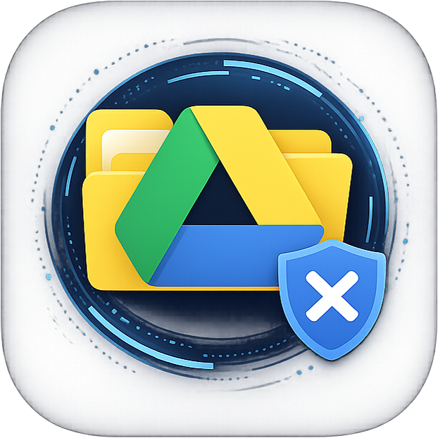
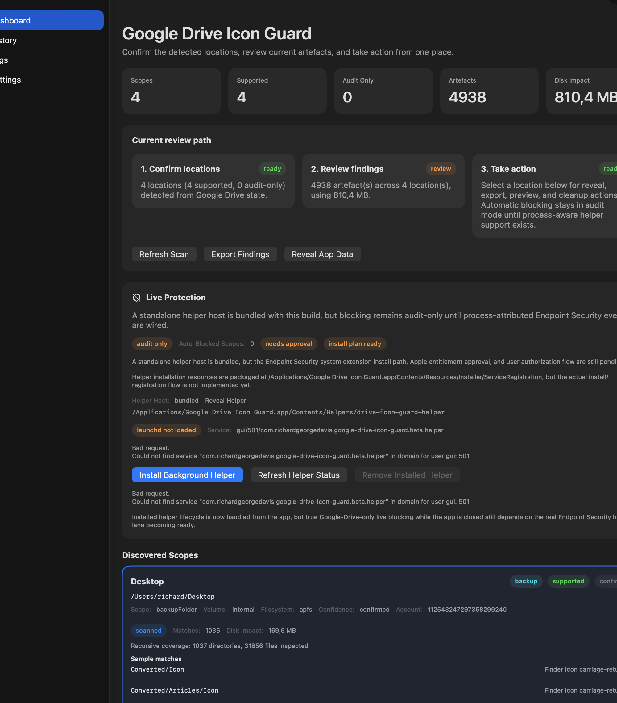
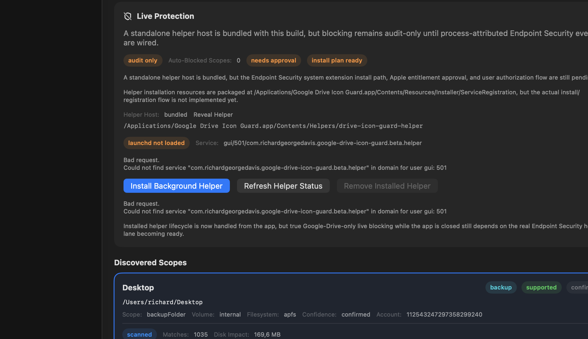

# Google Drive Icon Guard



Google Drive Icon Guard is a macOS utility aimed at stopping Google Drive from generating invisible icon files across synced locations.

The current beta does that conservatively for now: it discovers Google Drive-managed locations, scans those scopes in audit-only mode for hidden icon artefacts, and includes the first helper/runtime scaffolding needed before narrow prevention can be turned on safely.

This repository is currently in active development and should be treated as **beta**. The current codebase is still in the inventory and audit stage, not the final app release stage.

If you found this repo while searching for a fix for Google Drive hidden files on Mac, that is the right problem space. This project is specifically about Google Drive for desktop on macOS creating or preserving invisible Finder icon artefacts such as `Icon\r` and `._*`, but the current public build is still a beta diagnostic and audit tool rather than a finished one-click fix.

## Common Search Symptoms

People usually land here while searching for things like:

- `google drive hidden files mac`
- `google drive creates icon files on mac`
- `Icon\\r files google drive`
- `._ files google drive mac`
- `google drive invisible files finder metadata`
- `google drive folder icons syncing to external drive`
- `mac google drive keeps creating hidden icon files`

This repo is intended to help with that class of problem by making the affected Google Drive-managed locations visible, measuring the artefacts, and preparing for narrower prevention in supported scopes.

## What This App Aims To Be

The intended final release is a downloadable macOS app, not just a source-only CLI.

The release target is a Mac app that can:

- identify Google Drive-managed locations on the machine
- show where Google Drive-generated invisible icon files and related hidden clutter are building up
- measure the scope of that clutter so it becomes visible and actionable
- classify which locations are safe for audit-only handling versus stronger protection
- eventually stop Google Drive from generating or persisting those invisible icon files in supported scopes

Early public releases should be considered beta builds while the discovery, classification, and safety model are proven out.

## Planned Architecture

The intended final product is not just a viewer app.

Planned components:

- a macOS app for inventory, review, settings, and user-facing workflow
- a helper/service boundary for later narrow, process-aware protection work
- installer/setup flow for registering that helper only when the project reaches that stage

The current public beta now bundles a standalone helper host binary plus installer scaffold resources. The app can now install, refresh, and remove the background LaunchAgent helper path for beta evaluation, but it still does **not** ship the final entitlement-backed Endpoint Security host/system-extension flow required for true Google-Drive-only live blocking while the app is closed.

The repo now also includes a runtime-support library for an Xcode-hosted live Endpoint Security lane:

- `DriveIconGuardRuntimeSupport`
- `EndpointSecurityRuntimeCoordinator`
- dynamic framework loading for real `es_new_client` / subscription wiring without requiring SwiftPM to link `EndpointSecurity.framework`

## Beta Release Format

The repo now includes a practical beta packaging path for a downloadable macOS app.

Current beta packaging:

- unsigned-by-default `.app` bundle
- optional codesign + notarization path when release credentials are provided
- zipped beta archive for download
- helper status and provenance JSON emitted alongside the archive
- built from the current SwiftUI app shell
- bundles the viewer plus a standalone helper host binary
- packages helper install-plan scaffold resources
- app-managed helper lifecycle is available for the current LaunchAgent-based beta path, but there is still no entitlement-backed system-extension/runtime host flow for true live blocking

Build it locally with:

```bash
./Tools/release/build-beta-app.sh
```

Optional release-hardening inputs:

```bash
CODESIGN_IDENTITY="Developer ID Application: Example, Inc. (TEAMID)"
NOTARYTOOL_PROFILE="google-drive-icon-guard-notary"
CMS_SIGN_IDENTITY="Developer ID Application: Example, Inc. (TEAMID)"
./Tools/release/build-beta-app.sh
```

See:

- [Beta release packaging](./docs/beta-release-packaging.md)

## Why This App?

On macOS, hidden files like `Icon\r` and `._*` can quietly multiply when folder icon metadata gets preserved across synced locations. What starts as harmless Finder metadata can turn into thousands of invisible files, wasted storage, and unnecessary sync noise.

This app was built to tackle that problem. On my own Mac, those hidden artefacts grew to **40,000+ files using more than 6 GB** of space. The goal is simple: identify where Google Drive is managing files, surface the hidden icon clutter building up behind the scenes, and ultimately stop Google Drive from repeatedly generating that invisible mess in places where it is safe to do so.

In practical terms, this repo is for people dealing with symptoms such as:

- Google Drive for desktop creating invisible files on macOS
- repeated `Icon\r` files inside synced folders
- `._*` AppleDouble sidecar files multiplying in Google Drive locations
- Finder folder icon metadata leaking into mirrored or backup roots
- sync noise, storage bloat, or cleanup churn caused by hidden icon artefacts

## Current Development Status

The repo is currently centered on **inventory, review, and helper scaffolding**, with live Google-Drive-only blocking still gated behind OS-specific integration.

Right now the codebase can:

- probe common Google Drive macOS config roots
- read DriveFS `root_preference_sqlite.db` for configured My Drive and backup roots
- read per-account DriveFS `mirror_sqlite.db` data to confirm configured roots
- fall back to visible `~/Library/CloudStorage/GoogleDrive*` stream-style scopes when configured My Drive roots are unavailable
- classify scopes by volume kind, filesystem kind, and support status
- scan supported and audit-only scopes for `Icon\r` and `._*` artefacts
- report per-scope match counts, sample paths, and total storage impact
- persist the latest scope snapshot to `cache/scope-inventory/latest.json`
- keep timestamped history snapshots under `cache/scope-inventory/history/`
- show recent snapshots and current-versus-previous history deltas in the viewer
- package a standalone helper host for replay/test protection evaluation
- expose helper runtime/install readiness in the app and helper CLI
- install, refresh, and remove the background LaunchAgent helper path from the app UI
- persist helper protection configuration so the installed helper can restore its last-known scope set
- switch the app to the installed Mach-service helper boundary when that background helper is loaded
- package installer scaffold resources so the build can report `installPlanReady`
- open a lightweight SwiftUI app shell for discovered scopes via `swift run drive-icon-guard-viewer`

It does **not** yet ship the real Endpoint Security host target, approved entitlement path, or final Google-Drive-only live blocking path needed for true closed-app prevention.

## Test Builds

Alpha and beta tester builds can now be published directly through GitHub Releases with the packaged zip, checksum, helper-status JSON, and provenance JSON attached to the release entry.

Those releases should still be treated as prereleases. Even when the packaging lane is green, the shipped claim remains audit-first until the entitlement-backed Endpoint Security host lane exists.

## Preview

Representative app captures from the current beta build:





[Full App Screenshot](./docs/images/app-full-screenshot.png)

What is now in place for the next stage:

- a runtime-support coordinator that combines the helper policy engine, ES subscriber, and live-session wiring
- an Xcode integration guide for using that coordinator in a signed host target
- tests covering live-session success, failure, and callback-to-policy flow in the runtime lane

## Quick Start

```bash
swift build
swift run drive-icon-guard-scope-inventory
swift run drive-icon-guard-viewer
swift run drive-icon-guard-helper --status
swift run drive-icon-guard-helper --help
swift test
```

## Testing

The test target in this repo runs real assertions when a full Xcode toolchain is available.

If a contributor is using only Apple Command Line Tools, `swift test` may degrade into a build-only pass because Apple does not expose the usual Swift test frameworks in that setup.

To fix that locally:

1. Install full Xcode.
2. Point the active developer directory at Xcode:

```bash
sudo xcode-select -s /Applications/Xcode.app/Contents/Developer
```

3. Verify the toolchain:

```bash
xcode-select -p
swift --version
swift test
```

This machine is now using full Xcode successfully, and the repo also includes a macOS GitHub Actions workflow so CI runs against a full Apple toolchain instead of Command Line Tools alone.

## Project Docs

- [Project handover](./docs/google-drive-icon-guard-handover.md)
- [Current progress handover](./docs/current-progress-handover.md)
- [Changelog](./docs/CHANGELOG.md)
- [Development setup](./docs/development-setup.md)
- [Beta release packaging](./docs/beta-release-packaging.md)
- [Milestone 1 scope discovery notes](./docs/milestone-1-scope-inventory.md)
- [First-run guidance and troubleshooting](./docs/first-run-and-troubleshooting.md)
- [Public launch checklist](./docs/public-launch-checklist.md)
- [Code of Conduct](./.github/CODE_OF_CONDUCT.md)
- [Contributing](./.github/CONTRIBUTING.md)
- [Security Policy](./.github/SECURITY.md)
- [Support](./.github/SUPPORT.md)
- [MIT License](./LICENSE)

## Repo Layout

```text
google-drive-icon-guard/
├── App/
│   ├── ScopeInventory/
│   ├── UI/
│   ├── Logs/
│   ├── Settings/
│   └── XPCClient/
├── Helper/
├── RuntimeHostSupport/
├── Shared/
│   ├── Models/
│   ├── IPC/
│   └── Utilities/
├── Installer/
├── Tools/
│   ├── ProtectionHelperCLI/
│   └── ScopeInventoryCLI/
└── Tests/
```

The current implementation keeps the project honest: inventory first, audit visibility next, helper host plus install scaffolding now, and true Google-Drive-only blocking only after Endpoint Security integration and a real install/runtime path.
